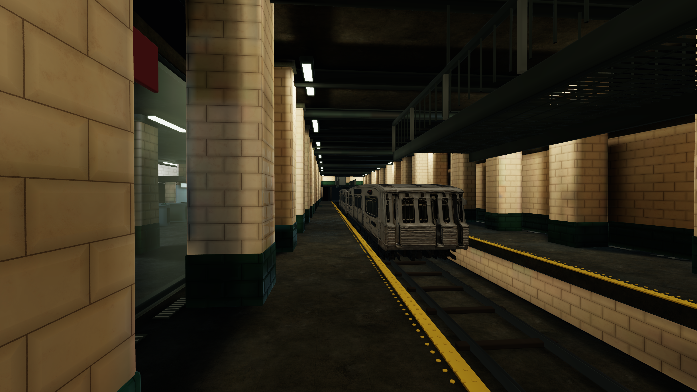
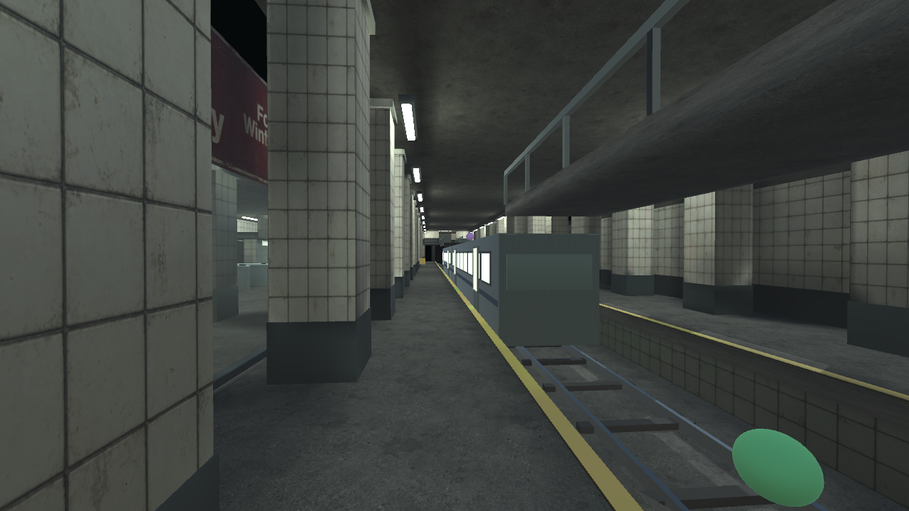

# Lower Bay

A reconstruction of the unreleased 2013 UberStrike subway map, based on the
surviving walkthroughs. The original map binary has not been recovered.

## Lower Bay 2026

The 2026 visual continuation uses the owner's four Hunyuan-converted props: a
subway car, station bench, vending machine and litter bin. It adds 24 native 4K
PBR maps, measured FBX LODs, chamfered architecture, steel catwalk grating,
station lettering, equipment details and baked station lighting.

**[2026 build, asset provenance and evidence](reimagine-2026/README.md)**

Build the included `playable/unity` project with `Build-Unity.ps1 -Realism2026 -Bake`.
Prepared assets are checked in. The larger 2026 package and Windows player are
generated locally; the linked package below is the earlier blockout baseline.

## Playable reconstruction baseline

The baseline is a self-contained **Unity 6000.0.56f1 walkthrough** with
connected upper rooms, platforms, concourse, service rooms, moving train, pickup
markers and a first-person controller. Its editable map, scripts, AI textures,
Blender source and verification are included.

**[Open/build instructions and controls](playable/README.md)** ·
**[Unity package](export/unitypackage/LowerBay_Playable.unitypackage)** ·
**[Build status and acceptance boundaries](docs/PLAYABLE_REVIEW.md)**

Import the package into a Built-in Render Pipeline project with the legacy Input
Manager, open its generated scene under `Assets/StrikeMapStudio/Maps/`, and press
Play. The package contains a map-only walkthrough; native-game combat, bots,
authenticated item appearance, legacy engine compatibility and multiplayer remain
outside the verified scope.

## Map identity

One sunken track and a two-car train separate two tiled platforms. A broad,
glass-sided concourse forms one flank; a narrow solid-wall passage and advertisement
alcove form the other. Upper rooms connect through ramps and return passages to
dead-end catwalks. Their open tips require a committed drop onto the train roof.

The platform is at Y=0, trench at -1.2, train roof at 2.2, catwalks at 3.0 and upper
rooms at 3.4 metres. The playable candidate extends the tunnel bounds to 134 × 29 m
to contain its inferred train movement. It has three spawn markers at each end and
eleven pickups. These are authored reconstruction values, not recovered measurements.

New AI materials are applied to actual scene geometry. Prompts, origins and exact
asset hashes are in [`playable/generated/`](playable/generated/). The study image is
a design reference; all files under `preview/playable/` are actual engine captures.

## Source and history

The reference priority remains the three original videos, the storyboards,
[`LOWER_BAY_CANONICAL_FACTS.md`](reference/LOWER_BAY_CANONICAL_FACTS.md), then the
machine-readable [`spec/`](spec/). Conflicting revisions, hidden geometry and
inferred train timing are identified in the playable map's provenance.

- [Stratos Kotsakos walkthrough](https://www.youtube.com/watch?v=tvBSZ8nwL4M)
- [wsdea walkthrough](https://www.youtube.com/watch?v=dOicvrsSRFg)
- [DewiLseS walkthrough](https://www.youtube.com/watch?v=-B_oqYj6YBY)

The original v1 candidate is preserved at `blender/map_master.blend` and
`export/unitypackage/LowerBay_v1.unitypackage`. The original Blender scripts and
legacy shaders remain under `blender/scripts/` and `export/unity/`. Their historical
build limitations are recorded in [`docs/BUILD_STATE.md`](docs/BUILD_STATE.md),
[`docs/STRUCTURAL_CORRECTION_FINDINGS.md`](docs/STRUCTURAL_CORRECTION_FINDINGS.md) and
[`docs/OWNER_REJECTION_AND_REAUDIT.md`](docs/OWNER_REJECTION_AND_REAUDIT.md).

The new reproducible pipeline is in `playable/`; its packed Blender and animated
GLB deliverables are in `export/playable-blender-final/`. It does not overwrite or
retroactively certify the old v1 scene. Internal `LowerBayAstra` names in that
original scene remain unchanged.
