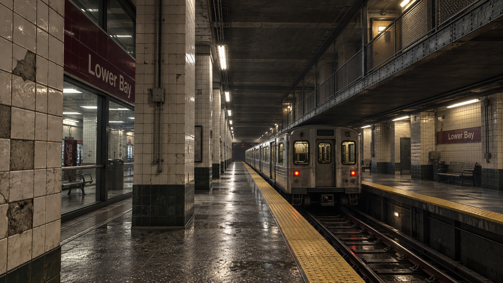
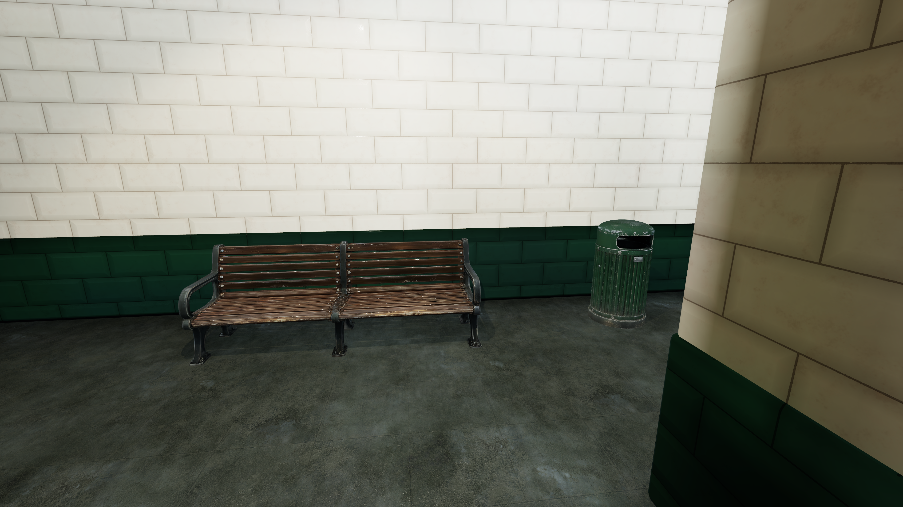

# Lower Bay 2026

This continuation takes the verified playable reconstruction toward the generated
station concept. The map contract still defines the platforms, track, upper rooms,
return routes, catwalk drop, pickups and moving train. The 2026 builder adds a visual
layer to that layout.



## Reality gaps addressed

| Gap | Implementation |
| --- | --- |
| Box train and furniture | Owner-supplied textured subway car, slatted bench, vending machine and fluted bin; measured scale and floor pivots |
| Flat material response | Native 4096 x 4096 color, normal and metallic/roughness maps on the props; native 4K ceramic and concrete PBR sets |
| Razor-sharp corners | Geometry chamfers on architectural boxes, retaining their collision transforms |
| Missing manufactured detail | Tactile studs, drainage fittings, I-section beams, bolts, conduits and walkway infill |
| Painted sign lettering | Legible lettering on maroon enamel signs |
| Uniform lighting | Warm platform fixtures, cooler concourse lighting, baked indirect light and contact occlusion, reflection probes and a restrained film tone curve |
| Unproven 4K claims | Import assertions require 24 native 4K maps; packaged-player verification supports actual 3840 x 2160 captures |

The concept is art direction, not recovered real-world geometry. Exact historical
dimensions, original train timing and multiplayer integration remain outside the
standalone reconstruction's verified scope.

## Owner asset intake

The owner converted the four AI references with Hunyuan and supplied GLBs. Each
contains one static mesh, one material, three embedded 4096 x 4096 PNGs, no skin and
no animation. Both sides were rendered in Blender 5.1.2 before assigning identities.
Original GLBs remain unchanged; source hashes are in the intake receipt.

| Asset | Source triangles | LOD0 | LOD1 | Maximum sampled source-to-LOD0 surface distance |
| --- | ---: | ---: | ---: | ---: |
| Bin | 500,000 | 35,000 | 10,000 | 1.08 mm |
| Vending machine | 499,262 | 69,999 | 22,000 | 1.01 mm |
| Subway car | 499,270 | 140,000 | 45,000 | 12.70 mm |
| Bench | 500,000 | 80,000 | 28,000 | 0.79 mm |

Distance checks sample about 3,100 source vertices per asset in metre scale; they
complement visual inspection. Prepared FBXs and untouched embedded maps are under
`playable/unity/Assets/LowerBay2026/Props`. FBX is the Unity delivery format.
**GLB with embedded textures remains the preferred owner handoff.**
The Unity materials preserve the GLBs' two-sided setting, including their visible
back surfaces and normal orientation.

The AI references and full prompts are retained in `hunyuan/references` and
`concepts/prompts.json`. Hunyuan conversion is owner-reported; the files identify
their exporter as Blender's glTF exporter.

## Surface sources

[Tiles008](https://ambientcg.com/view?id=Tiles008),
[Concrete048](https://ambientcg.com/view?id=Concrete048) and
[Concrete033](https://ambientcg.com/view?id=Concrete033) are from ambientCG under
[CC0](https://docs.ambientcg.com/license/), which permits raw-map distribution.
`evidence/materials-provenance.json` records the download URLs, archive hashes,
dimensions and hashes of the maps used. No paid asset library is required.

## Build and inspect

Open `playable/unity` in Unity 6000.0.56f1. The editor menu
**Tools > Lower Bay > Build baked 2026 scene** builds and opens the scene.
To also build the Windows player, run from the repository root:

```powershell
./playable/Build-Unity.ps1 -Unity 'C:/Program Files/Unity/Hub/Editor/6000.0.56f1/Editor/Unity.exe' -Realism2026 -Bake
```

The launcher prints a process ID and log/receipt paths. Wait for completion and
inspect `reimagine-2026/local/build/build.json`; launch alone is not success.
Outputs are a separate player at `playable/builds/LowerBay2026/LowerBay2026.exe`
and an importable package at `reimagine-2026/local/LowerBay2026.unitypackage`.
The previous playable baseline is retained. Large generated packages, players
and caches are local build outputs.

For package import into another project, use the **Built-in Render Pipeline**,
**Linear** color space, the legacy Input Manager and full-resolution textures
(global mipmap limit 0). These project settings are not carried by a Unity package.
URP, HDRP and other Unity versions are outside this verification.

Launch the player with
`-lowerBayVerify <new-absolute-output-directory> -lowerBay4K` to exercise the native
CharacterController, train and renderer. The output directory must not exist.
Read `runtime.json`, inspect the PNGs and check the exit code. The fixture covers
45 directed traversal routes, the catwalk drop, upper floor closure, train carry
and reset behavior, and pickups. The 2026 mode also requires the 4K maps to be loaded.

`tools/prepare_hunyuan.py` regenerates the FBX LODs in a fresh Blender 5.1 process;
`LOWER_BAY_INCOMING` overrides its source folder. `tools/prepare_materials.py`
extracts the required maps from the recorded ambientCG archives placed in `local/`.
Prepared assets are checked in, so neither regeneration step is needed to build.

## Evidence

The Windows player passed all **45 directed routes**, train carry and contact
reset, pause/reset, pickups, the committed catwalk drop and upper-floor support.
The final scene has 930 authored entities, 280 authored colliders, 206 enabled
renderers, 9 prop instances with 18 LOD levels, 24 native 4K maps, 182 baked light
probes and 7 baked reflection probes. The 13 PNGs in `evidence/runtime/` are
unmodified **3840 x 2160 captures from the Unity player**, not generated images.




Verification used Unity 6000.0.56f1 on an NVIDIA GeForce RTX 5070 Ti. The fresh
empty-project import passed with zero missing scripts, valid asset references,
baked lighting and all four two-sided prop materials. The 13 compiler regression
tests also passed. No frame-rate target or original-game integration is certified.

- [Visual review and remaining limits](evidence/visual-review.md).
- `evidence/runtime/runtime.json`: native traversal and render assertions.
- `evidence/package-import.json`: fresh-project import of the final package.
- `evidence/delivery.json`: final package, source asset and capture hashes; all
  1,044 packaged assets inspected and 52 prepared/source files matched.
- `evidence/regression-tests.json`: 13 passing regression tests.
- `evidence/unity-build.json`: geometry and lighting bake receipt. Its package
  hash records the earlier export made by that build.
- `evidence/unity-export.json`: final material/player export, including the
  two-sided prop correction. Its package hash matches the final delivery and
  fresh-import receipts.
- `evidence/hunyuan-intake/receipt.json`: source hashes, bounds and original previews.
- `evidence/hunyuan-preparation.json`: FBX hashes, triangle counts and sampled distance checks.
- `evidence/materials-provenance.json`: surface provenance and native 4K dimensions.

The verified local `LowerBay2026.unitypackage` is 398,093,482 bytes, with SHA-256
`813bf4b74cbb345d61400189bf78112bf8afda254084022eeb3ed6f5971cf104`.
The unchanged map contract's SHA-256 is
`ea785e3fe2a3017365ae63308da9219a1acf377fe95344d93452fece66cec518`.
Unity-generated packages and bakes are not promised to be byte-identical on rebuild.

Disk cleanup receipts and machine diagnostics remain in the ignored `local/`
folder and are not included in the public package.
